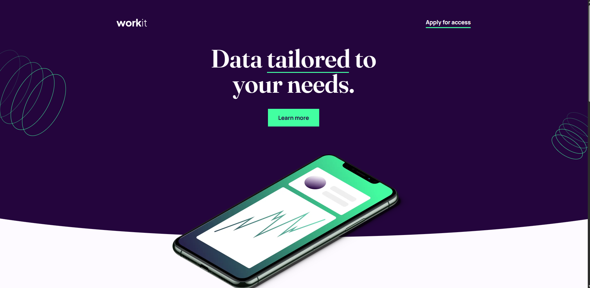

# Frontend Mentor - Workit landing page solution

This is a solution to the [Workit landing page challenge on Frontend Mentor](https://www.frontendmentor.io/challenges/workit-landing-page-2fYnyle5lu). Frontend Mentor challenges help you improve your coding skills by building realistic projects.

## Table of contents

- [Frontend Mentor - Workit landing page solution](#frontend-mentor---workit-landing-page-solution)
  - [Table of contents](#table-of-contents)
  - [Overview](#overview)
    - [The challenge](#the-challenge)
    - [Screenshot](#screenshot)
    - [Links](#links)
  - [My process](#my-process)
    - [Built with](#built-with)
  - [Author](#author)

## Overview

### The challenge

Users should be able to:

- View the optimal layout for the interface depending on their device's screen size
- See hover and focus states for all interactive elements on the page

### Screenshot

### Links

- Solution URL: [Github](https://github.com/Rahexx/WorkitLandingPage)
- Live Site URL: [Live Site](https://rahexx.github.io/WorkitLandingPage/)

## My process

### Built with

- HTML5
- SCSS
- Flexbox
- Mobile-first workflow
- BEM

## Author

- Frontend Mentor - [@Rahexx](https://www.frontendmentor.io/profile/Rahexx)
